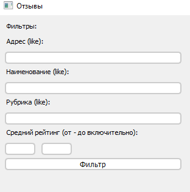
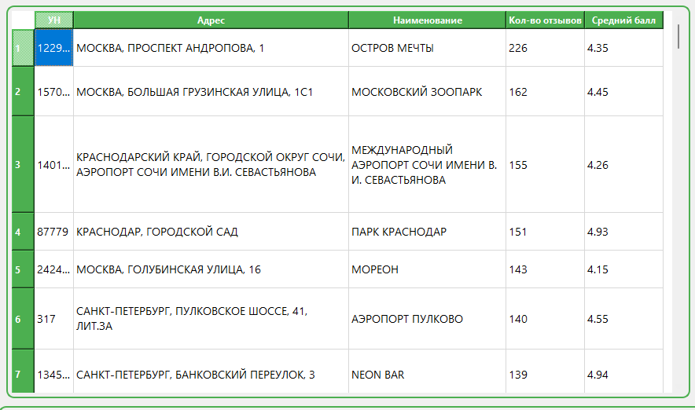
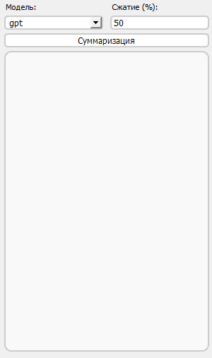
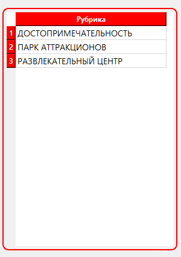
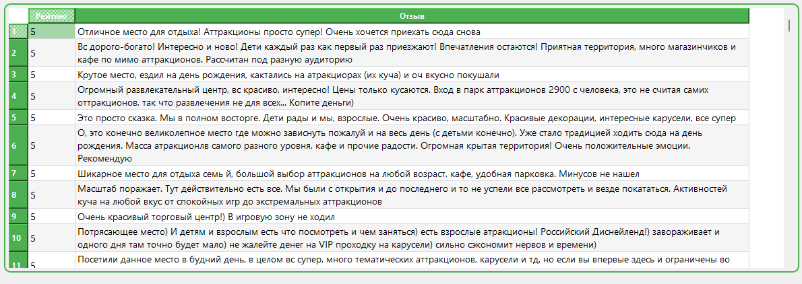

# Проектный практикум 3 
# Команда № 10

## Участники:  

Эрфан Абкадыров - QA инженер;  
Кудлай Дмитрий - документалист;  
Максим Ластин - ML-инженер;  
Александр Попов - разработчик.

### Краткое описание задачи: 
Создание нейронной сети для генерации текстовых отзывов о различных местах.  

### Цель проекта: 
Создать приложение, позволяющее пользователям получать краткие отзывы о различных объектах.

Для  запуска приложения запустить файл в папке `interface\ interface.py.`

Файлы структурированы:  
`analise` - EDA;  
`database` – скрипты для наполнения базы данных;  
`interface` – интерфейс приложения;  
`load_to_base` – обработка для загрузки dataset в базу данных;  
`server` – скрипты, выполняемые на сервере;  
`visual` - интерфейс программы.

План работы:
1. Загрузка данных
2. Предобработка данных
3. Выбор архитектуры модели
4. Обучение модели
5. Генерация текстов
6. EDA_NPL

## Интерфейс программы понятен интуитивно:

1. Область с фильтрами для отбора объектов:

2. Таблица для выбора организации, и общей информации о ней:

3. Элемент с возможностью выбора нейросети для суммаризации, и также регулирование степени сжатия текста:

4. Таблица с выбором категории интересующего обьекта генерации:

5. Таблица с готовым перечнем сгенерированных комментариев по выбранному объекту:

